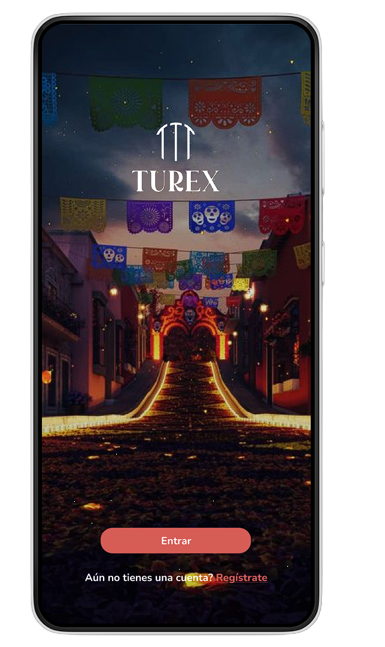
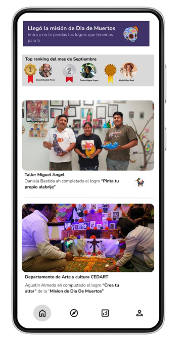

# GAMIFICACION

Esta aplicación fue creada como apoyo al turismo local


## Como utilizar

En este proyecto se utilizó Expo

[Ver la documentación](https://docs.expo.dev/get-started/installation/)

Para instalar Expo: 
```bash
  npm install --global expo-cli
```

Para cargar este proyecto:

```bash
  npm start
```




